<div align="center">


<br/>


<br/><br/>

> 🚀 Construyo soluciones web, móviles y cloud con enfoque en **productos reales de negocio**

</div>

---

## 👨‍💻 Sobre Mí

<table>
<tr>
<td width="65%" valign="top">

Desarrollador **Full Stack** enfocado en productos complejos — no solo CRUDs.

Resuelvo problemas de dominio difícil: **nómina agrícola**, **biometría**, **fiscal México**, **tesorería**, **empaque**, **e-commerce** e **IA operativa**.

Actualmente trabajo en paralelo sobre **3 productos activos en producción**.

</td>
<td width="35%" valign="top" align="center">

```text
🌐  Web ERP
📱  App Mobile
🛍️  Shopify Store
🤖  IA + WhatsApp
📡  Real-time
📴  Offline-first
```

</td>
</tr>
</table>

---

## 🎯 Productos Activos

<table>
<tr>
<td width="33%" align="center" valign="top">

### 🌐 Web ERP
<sub>*(privado · @JornalPro)*</sub>

<br/>

📊 Nómina semanal  
👥 Asistencias & cuadrillas  
💰 Tesorería & cajas  
📦 Empaque & logística  
🧾 Buzón SAT / CFDI  
🤖 Asistente IA Joni  

<br/>

`React` `TypeScript` `MUI` `Zustand` `Socket.IO` `PWA`

</td>
<td width="33%" align="center" valign="top">

### 📱 App Móvil
<sub>*(privado · @JornalPro)*</sub>

<br/>

📴 Offline-first  
🏷️ NFC & QR  
📍 Geolocalización  
🔄 Background sync  
👤 Alta de empleados  
📋 Operaciones de campo  

<br/>

`Flutter` `Riverpod` `sqflite` `WorkManager` `NFC`

</td>
<td width="33%" align="center" valign="top">

### 🛍️ Tienda Shopify
<sub>*(activa)*</sub>

<br/>

⚡ Hydrogen storefront  
☁️ Deploy en Oxygen  
🔌 Storefront API  
🛒 Admin API  
🎨 UX moderna  
📈 Headless commerce  

<br/>

`Hydrogen` `React` `TypeScript` `Shopify CLI`

</td>
</tr>
</table>

---

## 🔥 En lo que estoy metido

<table>
<tr>
<td align="center" width="20%">🏷️</td>
<td><b>NFC + Web</b> — Servicio REST para lectores <b>ACR122U</b> conectando tarjetas NFC con la plataforma web en tiempo real</td>
</tr>
<tr>
<td align="center">📦</td>
<td><b>Offline-first</b> — Paquete Flutter <a href="https://pub.dev/packages/betuko_offline_sync"><b>betuko_offline_sync</b></a> publicado en pub.dev</td>
</tr>
<tr>
<td align="center">👁️</td>
<td><b>Biometría híbrida</b> — HikCentral (facial) + persistencias NFC en campo</td>
</tr>
<tr>
<td align="center">🧾</td>
<td><b>Fiscal México</b> — Buzón SAT, descarga masiva CFDI y conciliación con tesorería</td>
</tr>
<tr>
<td align="center">🤖</td>
<td><b>IA operativa Joni</b> — Smart Router multi-canal (WhatsApp + chat web)</td>
</tr>
<tr>
<td align="center">📡</td>
<td><b>Real-time</b> — Socket.IO para buzón SAT, notificaciones y flujos en vivo</td>
</tr>
</table>

---

## 📊 Estadísticas

<div align="center">




<br/>




</div>

<div align="center">


</div>

---

## 📦 Repos Públicos Destacados

<div align="center">

| | Repo | Stack | Descripción |
|:---:|:---|:---:|:---|
| 🏷️ | [**nfc-service**](https://github.com/betuko37/nfc-service) | `Node.js` | Servicio REST NFC · ACR122U · instalador macOS · consola web |
| 📴 | [**online_offline**](https://github.com/betuko37/online_offline) | `Flutter` | Paquete offline-first · sync automático · pub.dev |
| 🔄 | [**sincronizacion_app**](https://github.com/betuko37/sincronizacion_app) | `Dart` | Prototipos de sincronización móvil |
| 💬 | [**Chat-App-socket-React**](https://github.com/betuko37/Chat-App-socket-React) | `React` | Chat en tiempo real con Socket.IO |
| 💲 | [**lista-precios**](https://github.com/betuko37/lista-precios) | `JS` | App web de lista de precios |

<sub>💡 El ERP en producción (web + backend + mobile) vive en repos privados de <a href="https://github.com/JornalPro">@JornalPro</a></sub>

</div>

---

## 🌾 Dominios del ERP *(privado)*

<table>
<tr>
<td width="50%" valign="top">

| | Módulo |
|:---:|:---|
| 💼 | Nómina semanal & cierre de semana |
| 👥 | Asistencias, cuadrillas & temporadas |
| 👁️ | Biometría HikCentral + NFC en campo |
| 🧾 | Buzón SAT · CFDI · timbrado |

</td>
<td width="50%" valign="top">

| | Módulo |
|:---:|:---|
| 💰 | Tesorería · cajas · transferencias |
| 📦 | Empaque · pallets · embarques |
| 🛒 | Compras · requisiciones · almacén |
| 🤖 | Joni IA · WhatsApp · chat web |

</td>
</tr>
</table>

---

## 💡 Lo que me diferencia

<div align="center">

| 🧩 Ecosistema completo | 📦 Open source con impacto | 🧠 Dominio de negocio |
|:---:|:---:|:---:|
| Web + Mobile + Shopify en paralelo | Paquete Flutter en pub.dev | Nómina · SAT · empaque · logística |

| 📡 Real-time & offline | 🤖 IA con propósito | 🔐 Seguridad empresarial |
|:---:|:---:|:---:|
| Socket.IO + sync offline en campo | Tools reales sobre el ERP | JWT · 2FA · RBAC multi-módulo |

</div>

---

## 🛠️ Stack Tecnológico

<div align="center">


</div>

<br/>

<table>
<tr>
<td width="50%" valign="top">

### 🎨 Frontend


### 📱 Mobile


</td>
<td width="50%" valign="top">

### ⚙️ Backend & Datos


### 🛍️ E-commerce & DevOps


</td>
</tr>
</table>

---

## 🎯 Experiencia Técnica

<details open>
<summary><b>🛍️ E-commerce & Shopify</b></summary>
<br/>

- 🛍️ Storefront custom con **Shopify Hydrogen**
- ☁️ Deploy en **Oxygen** (edge de Shopify)
- 🔌 **Storefront API** y **Admin API**
- 🛠️ **Shopify CLI** para desarrollo y deployment

</details>

<details>
<summary><b>📱 Mobile Development</b></summary>
<br/>

- 📱 Cross-platform con **Flutter** y **Dart**
- 🏗️ **Clean Architecture** + **Riverpod**
- 📦 Paquete **betuko_offline_sync** en pub.dev
- 🔄 Offline-first, background sync, **NFC** y geolocalización

</details>

<details>
<summary><b>⚛️ Frontend Development</b></summary>
<br/>

- ⚛️ SPAs con **React** y **Vue.js**
- 📘 Type-safe con **TypeScript**
- 🎨 **MUI**, **Tailwind** y **Quasar**
- 📡 Real-time con **Socket.IO** · estado con **Zustand**

</details>

<details>
<summary><b>🚀 Backend Development</b></summary>
<br/>

- 🚀 APIs RESTful con **Node.js + Express**
- 🗃️ ORMs: **Prisma** y **Sequelize**
- ⏰ Cron jobs, webhooks, SAT/CFDI y WhatsApp Business API
- 🐍 **Flask** · 🔌 **PHP/Laravel**

</details>

<details>
<summary><b>🗄️ Base de Datos</b></summary>
<br/>

- 🐘 **PostgreSQL** — base principal
- 🐬 **MySQL** — datos relacionales
- 🔥 **Firebase** — BaaS y Realtime Database
- 📊 Esquemas, optimización de queries y migraciones

</details>

---

## 📫 Conecta Conmigo

<div align="center">

[](https://linkedin.com/in/betuko35)
[](mailto:betorolitos37@gmail.com)
[](https://github.com/betuko37)
[](https://pub.dev/packages/betuko_offline_sync)

<br/><br/>


</div>

---

<div align="center">

<sub>⚡ Hecho con dedicación desde Hermosillo, Sonora · México 🇲🇽</sub>

<br/><br/>


</div>
